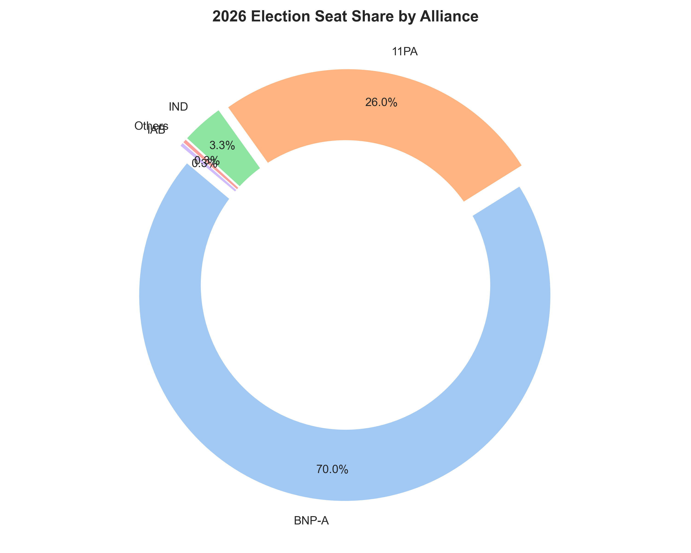
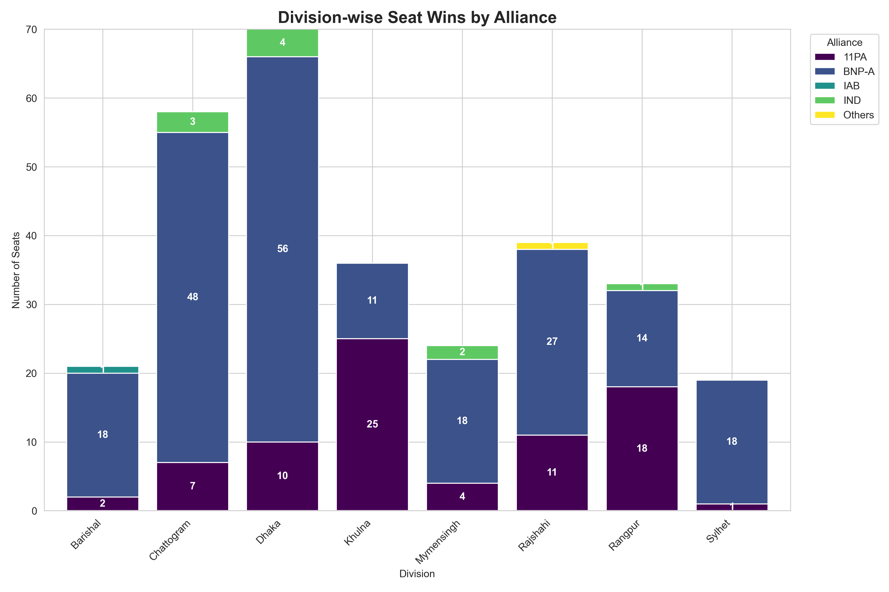
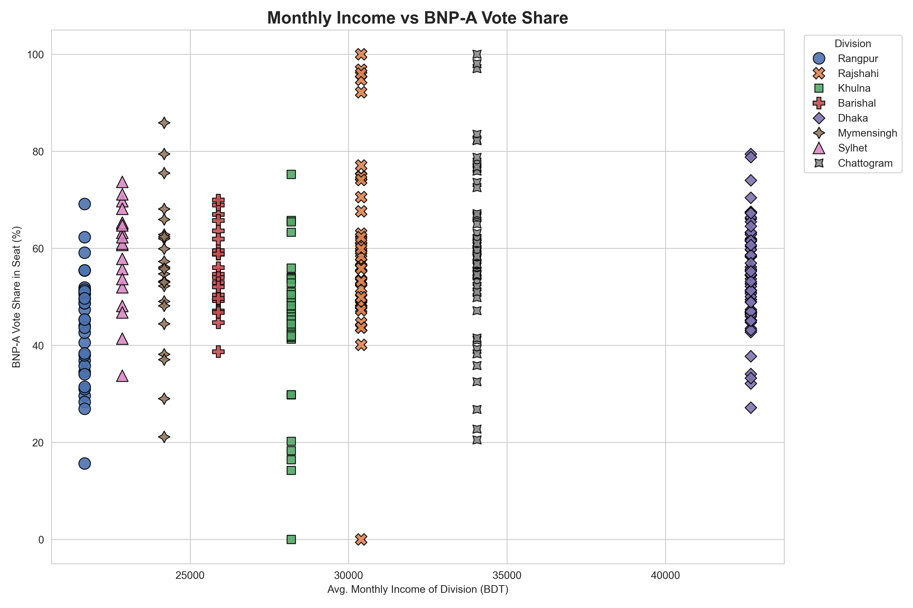
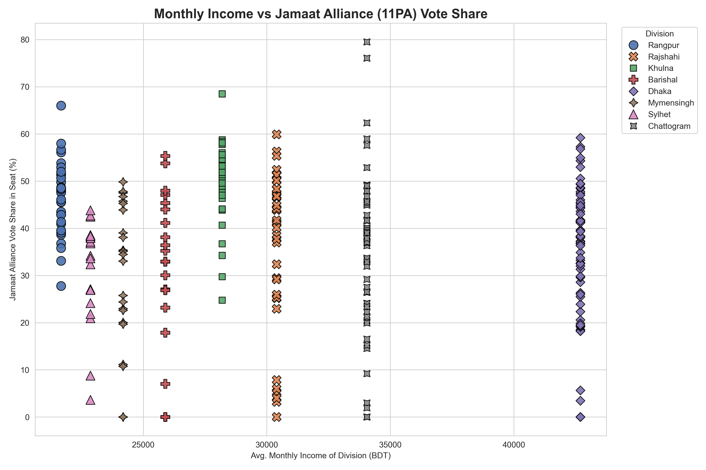
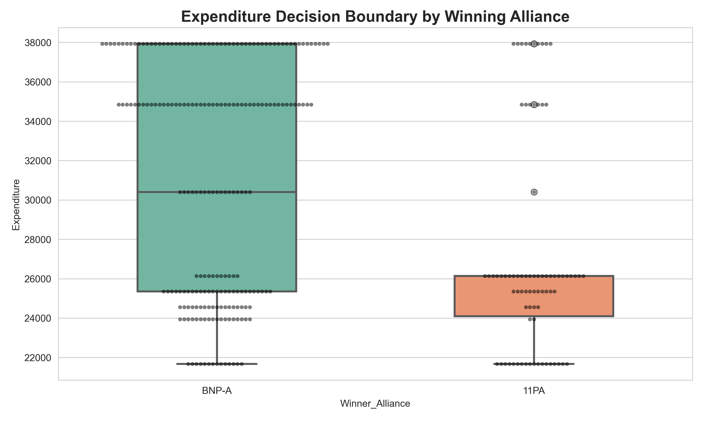
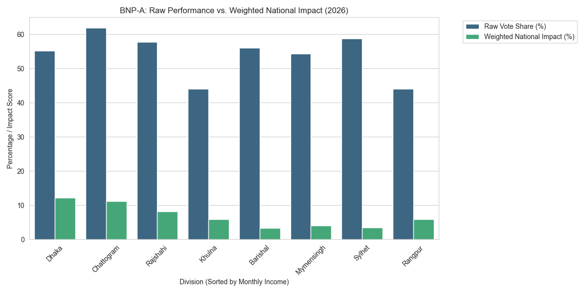
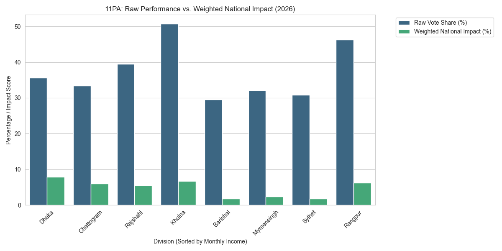

# Bangladesh Election 2026 — Economic & Electoral Analysis

A data-driven analysis of the 13th National Parliamentary Election of Bangladesh (2026), examining the relationship between regional economic indicators and electoral outcomes.

This repository contains an end-to-end pipeline for scraping election results, processing economic data (HIES 2022), performing weighted regional analysis, and modeling voting patterns using machine learning.

---

## Project Overview

This project investigates whether divisional income and expenditure levels are associated with political alignment. The workflow includes:

* Automated scraping of seat-wise election results (300 constituencies)
* Cleaning and aggregation of divisional economic indicators
* Weighted voter impact analysis by division
* Decision Tree classification to identify key predictive features
* Generation of analytical visualizations

---

## Repository Structure

```
Bangladesh_Election_Analysis_2026/
├── data/
│   ├── raw_election_data.csv
│   ├── seat_wise_votes.csv
│   └── division_analysis.csv
├── images/
├── src/
│   ├── analyze.py
│   ├── config.py
│   ├── process_data.py
│   ├── scraper.py
│   ├── visualize.py
│   └── weighted_analysis.py
├── main.py
├── requirements.txt
└── README.md
```

---

## Key Findings

* Higher-expenditure divisions show stronger alignment with the BNP-led alliance.
* Lower-expenditure divisions demonstrate greater support for the Jamaat-led alliance (11PA).
* Consumption expenditure is the dominant predictive feature in the Decision Tree model.
* High-population divisions (e.g., Dhaka and Chattogram) exert disproportionate influence on the national outcome due to voter weight.

---

## Analysis Visualizations

The following figures are automatically generated by the analytical pipeline and saved inside the `images/` directory.

### 1. National Seat Distribution



### 2. Division-wise Seat Wins



### 3. Income vs BNP-A Vote Share



### 4. Income vs 11PA Vote Share



### 5. Expenditure vs Winning Alliance (Decision Boundary Insight)



### 6. Weighted Impact — BNP-A



### 7. Weighted Impact — 11PA



> These visualizations collectively illustrate seat distribution, regional dominance, economic correlation trends, decision boundaries, and the weighted power contribution of each alliance.

---

## Tech Stack

* Python (Pandas, NumPy, Scikit-learn)
* Matplotlib, Seaborn
* Selenium, WebDriver Manager

---

## Installation & Execution

1. Install dependencies:

```bash
pip install -r requirements.txt
```

2. Run the full pipeline:

```bash
python main.py
```

If `data/raw_election_data.csv` is not generated automatically, add division names manually after scraping.

---

## Data Sources

* Election Results: Somoy News Election Portal
* Economic Data: Household Income and Expenditure Survey (HIES) 2022, Bangladesh Bureau of Statistics (BBS)
